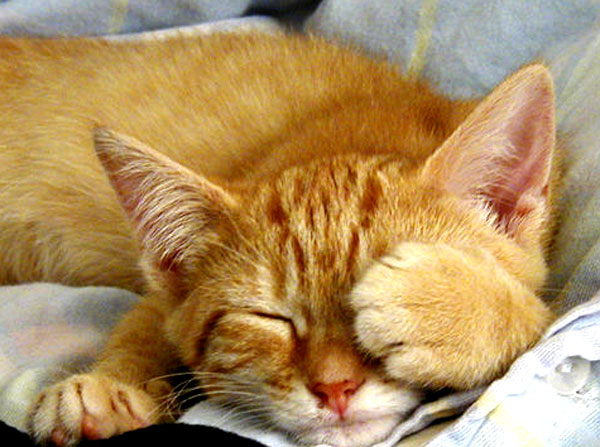

|  | Ph.D. Candidate   [Department of Electrical Engineering and Computer Science](http://eng-cs.syr.edu/our-departments/electrical-engineering-and-computer-science/)   [Syracuse University](http://www.syr.edu/)   Office: Science&Technology Center 4-226, Syracuse University   Address: 50 Presidential Plz 2006, Syracuse, NY, 13202   Email: qchen14 (at) syr (dot) edu |

 

[Profile](#profile), [Education](#education), [Research Projects](#research-projects), [Internship](#internships), [Publications](#publications), [Other Projects](#other-projects)

### PROFILE
I am currently a research assistant at the AMPS Lab at Syracuse University. My advisor is [Dr. Qinru Qiu](http://hydrogen.syr.edu/~qqiu/). Generally, my research interests are machine learning, cognitive applications and high performance computing on heterogeneous systems. In particular, I am working on anomaly detections using neuromorphic models as well as their acceleration and scalability. 

### EDUCATION
* Ph.D. in Computer Engineering, Syracuse University, Present
* M.S. in Electrical Engineering, [Beijing University of Posts & Telecoms](http://www.bupt.edu.cn/) (BUPT), 2012
* B.S. in Electrical Engineering, BUPT & [Queen Mary University of London](http://www.qmul.ac.uk/), 2009  
First class honours degree

### RESEARCH PROJECTS
**Neuromorphic framework for real-time anomalous stream detection**   
Developing a self-modeling knowledge network that provides continuous traffic monitoring and prompt anomaly detection/reasoning for massive concurrent data streams. Adopting cogent confabulation and layered feature hierarchy that mimic human cognition. Building prototype system on heterogeneous multicore platform with GPGPUs and MIC co-processors.

**Context-aware smartphone low power design**   
Learned battery consumption patterns from user behaviors to support control decisions that save device power while maintaining QoS.

**Intelligent Text Recognition System**   
Studying statistical inference based sentence completion model, coupled with BSB pattern matching to provide machines strong reading/synthesizing ability.

### INTERNSHIPS
**Alcatel-Lucent, Beijing, China, Jan 2012 - Apr 2012**  
Software Engineer: Developed and maintained wireless network elements management software. Ported C/C++ programs from Solaris to Linux servers.

**Potevio Institute of Technology, Beijing, China, May 2010 - Jan 2011**  
Baseband R&D Engineer: Developed a TD-LTE downlink demo platform and conducted system integration tests. Designed and programmed baseband processing modules and an on-chip protocol stack.

### PUBLICATIONS
1. **Qiuwen Chen**, Qing Wu, Morgan Bishop, Richard Linderman and Qinru Qiu, "Self-structured Confabulation Network for Fast Anomaly Detection and Reasoning", IJCNN'2015. [pdf](https://onedrive.live.com/redir?resid=731dfd14fe9cfc26!3654&authkey=!ADrNaUvbpNEDP7o&ithint=file%2cpdf)
2. **Qiuwen Chen**, Qinru Qiu, Qing Wu, Morgan Bishop, and Mark Barnell, "A Confabulation Model for Abnormal Vehicle Events Detection in Wide-Area Traffic Monitoring", CogSIMA'2014. [pdf](https://onedrive.live.com/redir?resid=731dfd14fe9cfc26!3265&authkey=!ADQHeHMSR5-wmO0&ithint=file%2cpdf)
3. Q. Wu, B. Liu, Y. Chen, H. Li, **Qiuwen Chen** and Qinru Qiu, "Bio-Inspired Computing with Resistive Memories - Models, Architectures and Applications", ISCAS'2014. [pdf](https://onedrive.live.com/redir?resid=731dfd14fe9cfc26!3268&authkey=!ACiVk_KEeN4zHAQ&ithint=file%2cpdf)
4. Hao Shen, **Qiuwen Chen** and Qinru Qiu, "Battery Aware Stochastic QoS Boosting in Mobile Computing Devices", DATE'2014. [pdf](https://onedrive.live.com/redir?resid=731dfd14fe9cfc26!3269&authkey=!APj99oDhh_Jneys&ithint=file%2cpdf)
5. **Qiuwen Chen**, Qinru Qiu, Hai Li and Qing Wu, "A Neuromorphic Architecture for Anomaly Detection in Autonomous Large-Area Traffic Monitoring", ICCAD'2013. [pdf](https://onedrive.live.com/redir?resid=731dfd14fe9cfc26!3270&authkey=!AHVWAC2oTla_E3E&ithint=file%2cpdf)
6. **Qiuwen Chen**, Z. Wu, Hao Jin, "A Multi-user Cooperation Scheme based on Component Demodulation", ICCTA'2011. [pdf](https://onedrive.live.com/redir?resid=731dfd14fe9cfc26!3266&authkey=!ANVG-RIklHd7W8s&ithint=file%2cpdf)
7. **Qiuwen Chen**, "Enhanced Turbo Network Coding with Additional Error Protection by Hybrid Iterative Decoding", ICCSN'2011. [pdf](https://onedrive.live.com/redir?resid=731dfd14fe9cfc26!3267&authkey=!AACW7Jc4CU0PXao&ithint=file%2cpdf)

### OTHER PROJECTS
**Cross-proximity probabilistic modeling of actor behavior:** designed a link prediction algorithm for dynamic social networks based on a dual hidden Markov model (HMM) coupled with diversified influence factors. [pdf](https://onedrive.live.com/redir?resid=731dfd14fe9cfc26!3272&authkey=!AJ834RwxkOOf5rk&ithint=file%2cpdf)

**Malware detection from system call sequences:** developed and evaluated learning based models such as replicator neural network, CFA and Bayesian net on identifying malicious programs.

**GPU acceleration of BCJR algorithm:** originated an augmented parallel algorithm that exploits the thread level parallelism. Verified the performance gain on GPUs. [pdf](https://onedrive.live.com/redir?resid=731dfd14fe9cfc26!3271&authkey=!AL4quwNIdHNAc4s&ithint=file%2cpdf)

**Resource usage prediction for cloud data center:** built a confabulation based statistic prediction model for virtual machine resource consumptions (clock cycles, memory, networks). [pdf](https://onedrive.live.com/redir?resid=731dfd14fe9cfc26!3273&authkey=!AMRQN410LntXkQw&ithint=file%2cpdf)

**VLSI computer aided design:** Implemented software with GUIs for a set of CAD algorithms: layout optimization, GORDIAN placement, simulated annealing, etc. [src](http://github.com/autchen/vlsi-cad)

**Joint coding modulation diversity:** Focused on adapting hybrid diversity techniques to aid wireless transmissions in fading channels. Designed a turbo receiver which harvests signal space diversity and coding gain jointly. Implemented a testbed on PicoChip many-core system.

**Multi-user signal space cooperation:** Developed a wireless cooperation scheme in uplink transmissions. Designed a 4D component demodulation method that enables multiple users exploiting path diversity in a cross-layered manner. [src](https://github.com/autchen/ssc-4d)

**Microcontroller-based Contour Mapper:** hardware & software co-design of a conceptual sensor robot that collects coordinate information and plot the contour map.

